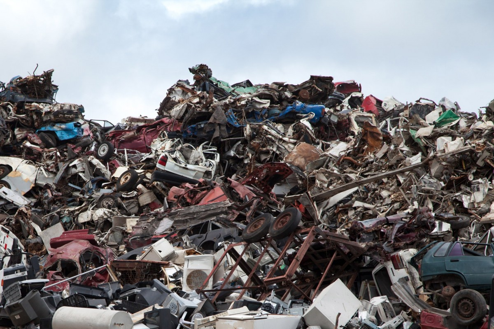

# Let's discuss memory
Before we go further in introducing more C++ concepts, we need to go under the 
hood and understand a bit more about how your computer works, in particular 
how memory works.

Many other programming languages manage memory for you (they give you a very 
high level of abstraction of what's actually happening). You don't have to 
worry about issues like _memory leaks_ and _dangling pointers_. C++ takes a 
much more hands-off approach to memory; you have a lot more control, but you're
so much more free to shoot yourself in the foot! To write safe and efficient
C++ programs you need to understand more of what's actually happening.

## What's memory?
Your program will be given some memory to use when it runs. The memory is
where it keeps all the variables and other data being used. When you write
```int x = 27;``` the value 27 is being stored somewhere in that memory.
Each position in memory has a unique address that can be used to access it.

The code of your program (the actual instructions that were made by the 
compiler) also has to be loaded into memory so that it can be given to
the processor to execute. That's something that's important to understand, but
we're not going to worry about here.
 
The memory we're referring to here is generally your computer's RAM (as 
opposed to its hard drive where your files are stored).

While your program is running, the memory it's using is divided mostly into
two parts, the *stack* and the *heap*.

## The stack
Think of the stack exactly like a stack of plates, except each plate contains
delicious data. Also the plates are called _stack frames_. The stack starts 
empty when your program begins. Plates (I mean stack frames) are added and 
removed at the top of the stack only. 


_Perfect visual metaphor_

When the program enters ```main()``` a frame is added to the stack. Every 
time you define a new variable in ```main```, it is stored in that frame.

When a function is called, a new frame is added to the stack. Any arguments 
that were passed to the function are copied into its stack frame. Any local
variables within that function are also stored in its stack frame. The same
is true for any functions which _that function_ calls. When the function 
returns, its return value is copied down to the stack frame below. Then the
function's stack frame is removed from the top of the stack. The variables
it contains have been removed from memory and no longer exist.

Simple right? All this has been happening in every program you've written so
far without you even knowing about it. Memory is being added and removed 
(allocated and deallocated) as it's needed by your program without you doing
anything.

But can you see any problems with this way of using memory? Let's say there's
some really big piece of data that our program is made to operate on. It's a 
big database of customer details or particle collisions or something. It's 
hundreds or thousands of megabytes in sizes. Lots of functions will want to 
access this data. In the stack model, every time we call a function that
needs to take the database as an argument, a huge amount of data is being 
copied into the new stack frame. If the function also updates the database, 
it will have to return a copy of it which is copied back to the stack frame
below.

Not only is all this copying slowing down our program, it's using up more 
and more memory as functions call other functions and more frames are added 
to the stack.

Adding so much to the stack that we run out of memory is called a *stack
overflow*. Sound familiar?

If only we could keep this data somewhere else. We only actually need one
copy of it to exist in memory. All these functions just need to know where it 
is to be able to access it. We could add it in to memory when we first need it
and remove it when we're done with it.

## The heap
The heap is a big unstructured pile of memory. When your program needs some 
memory on the heap, it can ask for some to be _allocated_ for it. Once a piece
of memory is allocated on the heap, it remains there either until it is 
explicitly deallocated by the program, or until the program ends.


_Another beautiful metaphor_

Let's go back to our example above. At some point in the program the database 
is created. Maybe it is loaded from our hard drive or generated from the 
particle accelerator connected to our USB port. Either way, the program asks 
for some memory to be allocated to contain the data.

The program is given a memory address to tell it where to find the database
in memory. Now, what happens when we want to call a function that needs to 
access the database? We just need to give that function the address of the 
data and it can go and access it! The only thing that needs to be copied into
the function's stack frame is the address of the data, rather than all the 
data itself. In addition, the function can update the database on the heap too,
without making a copy of it.

At some later point, all the work the program needed to do with the database
is finished. It can ask for the memory to be deallocated and we're all done.

Cool, we avoided lots of the problems with keeping our data directly on the 
stack. But can you think of any other problems this could introduce?
What if we forget to deallocate our memory once we're done? It'll just sit
around for the rest of the runtime of the program. The longer the program 
runs the more data might be left around, unused but still allocated. This is
called a _memory leak_. Conversely, what if we deallocate our memory too soon?
Maybe there's still a copy of that address sitting around somewhere, and the
program tries to use it after the memory has been deallocated. The program 
might crash if it's no longer allowed to access that part of memory, or it 
might continue running just fine, but what it thinks is your data is just 
some random other part of memory which it's reading and writing. As you can
imagine, that's a _bad thing_.

## Stay tuned
After that quick diversion, next time we'll apply our new knowledge in C++ 
itself. Quick preview, in C++ a variable containing a memory address is 
called a *pointer*.